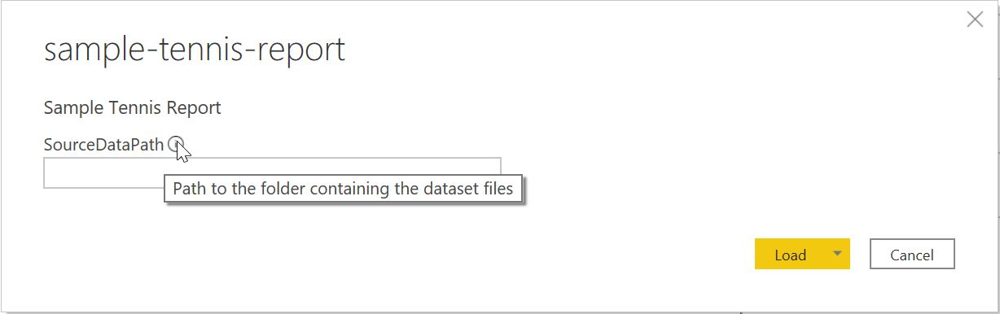

# Power BI Tennis Report

## Configuration
Follow these steps to configure and visualize the report using Power BI Desktop:

1. If not already installed, download and install Power BI Desktop either from the [Microsoft Website](https://powerbi.microsoft.com/en-us/downloads/ "Microsoft Website") or the [Windows Store](https://www.microsoft.com/en-us/p/power-bi-desktop/9ntxr16hnw1t?activetab=pivot:overviewtab "Windows Store").
2. The report uses the [ATP World Tour Tennis dataset](https://datahub.io/sports-data/atp-world-tour-tennis-data "ATP World Tour Tennis dataset") provided by [Datahub](https://datahub.io/). Download the CSV dataset files and extract them in the [report/dataset/](dataset/) folder.
3. This repository contains extra dataset files used by the report. Extract the tarball (`.tar.gz`) files in [report/dataset/](dataset/) into the same folder.
4. Start Power BI Desktop and open the `sample-tennis-report.pbit` file located in this folder. You will be prompted to enter the path for the data source folder. Specify the path to the [report/dataset/](dataset/) folder and click **Load** -it will take a few minutes to complete importing the data into the report.

