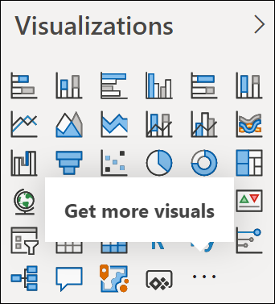
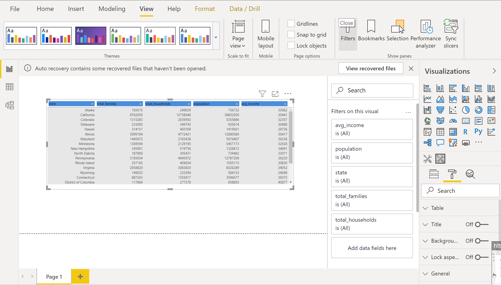
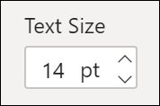
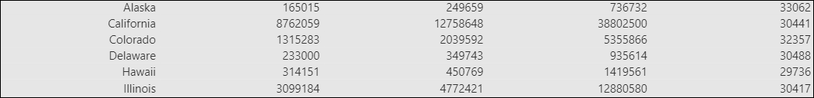

# Styling Custom Visuals #

## Summary

This sample shows how to style a custom visual from the Formatting pane, Power BI built-in themes and custom themes. The visual is developed with [Power BI's custom visual SDK](https://docs.microsoft.com/en-us/power-bi/developer/visuals/environment-setup?tabs=windows) and [Tabulator](http://tabulator.info/), a library used for designing and styling our table. 

## Folder Structure

```
└─── styling-custom-visual
     │── assets
     │    │─── sample-dataset.xlsx 
     │    └─── sample-report.pbix 
     │
     │── custom-visual
     │    │── assets
     │    │    └─── icon.png 
     │    │ 
     │    │── dist
     │    │    └─── stylingCustomVisual.1.0.0.pbiviz
     │    │    └─── package.json
     │    │
     │    │── src
     │    │    │─── settings.ts  
     |    |    |─── tabulator-formatter.ts  
     │    │    └─── visual.ts 
     │    │
     │    │── style
     │    │    └─── visual.less 
     │    │
     │    │── capabilities.json 
     │    │── packages.json
     │    │── pbiviz.json
     |    |── theme.json
     │    │── tsconfig.json
     │    └── tslint.json
     │
     └─── README.md
```

## How to run this sample

A sample report with our custom visual imported on it can be found on *assets/sample-report.pbix*. If you want to get the custom visual running on *development mode*, follow the instructions below.

### Environment Setup

1. On [Power BI Service](https://app.powerbi.com/), go to **Settings/General/Developer** and click on *Enable custom visual debugging using the developer visual*.
2. Download and install [NodeJS](https://nodejs.org/en/).
3. Open a terminal and run the following command to install the [Pbiviz tool](https://docs.microsoft.com/en-us/power-bi/developer/visuals/environment-setup?tabs=windows#create-and-install-a-certificate):

```ps1
npm i -g powerbi-visuals-tools
```

4. Create and install a certificate to ensure secure interactions between your computer and the Power BI Service:

```ps1
pbiviz --install-cert
```

This command does two things: Returns a numeric *passphrase* and starts the *Certificate Import Wizard*.

5. Once the *Certificate Import Wizard* opens:

- Select *current user* as the store location
- In the *File to import* window select next.
- In the *Private Key Protection* window, in the Password text box, paste the numeric passphrase received when executing the previous step.
- In the *Certificate Store* window, select the *Place all certificates in the following store* option, and select Browse.
- Select *Trusted Root Certification Authorities*

### Running the custom visual on development mode
 
1. Open the command line and move to the ```custom-visual``` folder. Then install the project dependencies using *npm*:

```
npm install
```

2. Configure the [theme.json](./theme.json) file replacing the desired values between curly brackets:

   ```
   {
       "name": {Custom Theme Name},
       "dataColors": [
           {Hexadecimal Color Array}
       ],
       "background": {Hexadecimal Color},
       "foreground": {Hexadecimal Color},
       "tableAccent": {Hexadecimal Color},
       "visualStyles": {
           "{Custom Visual GUID}": {
               "*": {
                   "{Object defined in the capabilities.json}": [
                       {
                           "fontSize": {Font Size},
                           "rowBackgroundColor": {
                               "solid": { "color": {Hexadecimal Color} }
                           }
                       }
                   ]
               }
           }
       }
   }
   ```

3. Start the visual:

```
pbiviz start
```

Edit any report on [Power BI Service](https://app.powerbi.com/) and create a *Developer Visual* from the Visualization pane. Our custom visual will be displayed on thet created item.

### Importing the custom visual into a report

When you are ready to import the custom visual on your report definitely, package it:

```
pbiviz package
```

In the *Visualizations Pane* select *Get More Visuals*. Browse to the */dist* folder and select the *.pbiviz* file generated in the previous step. The default generated file should be named _stylingCustomVisual.*.pbiviz_.

## Implementation analysis  

In the sample _pbix_, we will use a ‘2010–2014 USA average income per state’ dataset and visualize its content using our created custom visual. However, this sample is isolated from the selected dataset, if you want to try it out with another dataset, just go ahead.

### Styling our visual from the formatting panel

1. Set up the ```capabilities.json```.

To know more about what the ```capabilities.json``` file does, [follow this documentation](https://docs.microsoft.com/en-us/power-bi/developer/visuals/capabilities). We'll use capabilities to provide information to the host about our visual. Declare a _dataTable_ object with a _Table_ display name on it. Each object will represent a different tab in the formatting pane. On its _properties_ we need to list what attributes from our visual we want to dynamically modify, like the *fontSize* in our case:

```
"objects": { 
     "dataTable": { 
         "displayName": "Table", 
         "properties": { 
             "fontSize": { 
                 "displayName": "Text Size", 
                 "type": { 
                     "formatting": { 
                         "fontSize": true 
                     } 
                 } 
             } 
             
             ...
```

2. Map the ```capabilities.json``` object's properties to their representations on the ```settings.ts```:

```typescript
import { dataViewObjectsParser } from 'powerbi-visuals-utils-dataviewutils';
import DataViewObjectsParser = dataViewObjectsParser.DataViewObjectsParser;

export class VisualSettings extends DataViewObjectsParser {
    public dataTable: tableSettings = new tableSettings();
}

export class tableSettings {
    // Text Size
    public fontSize: number = 12;
}
```

It’s a must to respect the naming conventions established in the ```capabilities.json```; otherwise, the *DataViewObjectsParser* won’t be able to map the objects along with their properties.

### Apply built-in theme colors to our custom visual

Microsoft provides the *color-utils* library that simplifies the applying of color themes on our custom visuals. To show this feature we will format our table header displaying the main color from our color palette on it. To access these attributes we can use the *IColorPalette* interface which handles default attributes such as the background, foreground, and the *dataColors* that represent the main color palette.

1. Import the ```IColorPalette``` interface:

```typescript
import IColorPalette = powerbi.extensibility.IColorPalette; 
```

2. Declare the ```IColorPalette``` element:

```typescript
private colorPalette: IColorPalette;
```

3. Inside the constructor, assign the ```IColorPalette``` element in the ```options.host.colorPalette``` to the recently declared ```colorPalette```:

```typescript
this.colorPalette = options.host.colorPalette;
```

4. Look up the first element from the *dataColors* array using the ```getColor()``` built-in function:

```typescript
private getTopColorFromPalette(): string {
    return this.colorPalette.getColor('1').value
}
```

5. Validate if user input has already been made for this property. If not, assign the color value into the settings, this will be reflected in the formatting pane:

```typescript
if(this.settings.dataTable.headerBackgroundColor === null) {
    this.settings.dataTable.headerBackgroundColor = this.getTopColorFromPalette()
}
```

6. Assign the background color to each header:

```typescript
public titleFormatter = (cell, formatterParams, onRendered): any => {
    cell.getElement().style.fontSize = this.settings.dataTable.fontSize + 'px';
    cell.getElement().style.backgroundColor = this.settings.dataTable.headerBackgroundColor;
    return cell.getValue();
};
```

7. Open your desired terminal and build the visual using *pbiviz package* command.

8. Open Power BI Desktop and click on the _Get more visuals_ button, inside the Visualization pane:



9. Click on _Import a visual from a file_ and select your custom visual, which has been stored inside the ‘dist’ folder. 

10. Test the new feature:



We can observe how the headers' background colors are targeted by the theme’s colors.

### Target our custom visual from a custom theme

We can also target our custom visual having a *theme.json* file created from scratch. This is useful in cases where we are sharing one theme between multiple reports and want to keep the same styling on all of them. In the example below, we can observe the *visualStyles* property defined in the *theme.json* targetting our custom visual by referencing its *guid* value found in the *pbiviz.json*, in our case _"stylingCustomVisual"_:

```
{
    "name": "Custom Theme",

    ...

    "visualStyles": {
        "stylingCustomVisual": {
            "*": {
                "dataTable": [
                    {
                        "fontSize": 14,
                        "rowBackgroundColor": {
                            "solid": { "color": "#e6e6e6" }
                        }
                    }
                ]
            }
        }
    }
}
```

To use these new properties defined above, we need to follow the same steps we described earlier. Add these settings to the ```capabilities.json```:

```
{

    ...
    
    "objects": {
        "dataTable": {
            "displayName": "Table",
            "properties": {
                "fontSize": {
                    "displayName": "Text Size",
                    "type": {
                        "formatting": {
                            "fontSize": true
                        }
                    }
                },
                "rowBackgroundColor": {
                    "displayName": "Row Background color",
                    "type": {
                        "fill": {
                            "solid": {
                                "color": true
                            }
                        }
                    }
                }
            }
        }
    }
    
    ...
}
```

Map them to their representations on the ```settings.ts``` file:

```typescript
'use strict';

import { dataViewObjectsParser } from 'powerbi-visuals-utils-dataviewutils';
import DataViewObjectsParser = dataViewObjectsParser.DataViewObjectsParser;

export class VisualSettings extends DataViewObjectsParser {
    public dataTable: tableSettings = new tableSettings();
}

export class tableSettings {
    // Text Size
    public fontSize: number = 12;
    // Row Background color
    public rowBackgroundColor: string = null;
}
```

These settings values will come pre-populated with the selected values. If these are null, default values found in the *settings.ts* will be assigned; otherwise, the theme attributes will override the default:




Now the visual has the row background property set to grey and its font size set to 14:



## Sources ##

- [Set up your environment for developing a Power BI custom visual](https://docs.microsoft.com/en-us/power-bi/developer/visuals/environment-setup?tabs=windows)
- [Add Colors to your visual](https://docs.microsoft.com/en-us/power-bi/developer/visuals/add-colors-power-bi-visual)
- [Tabulator](http://tabulator.info/)
